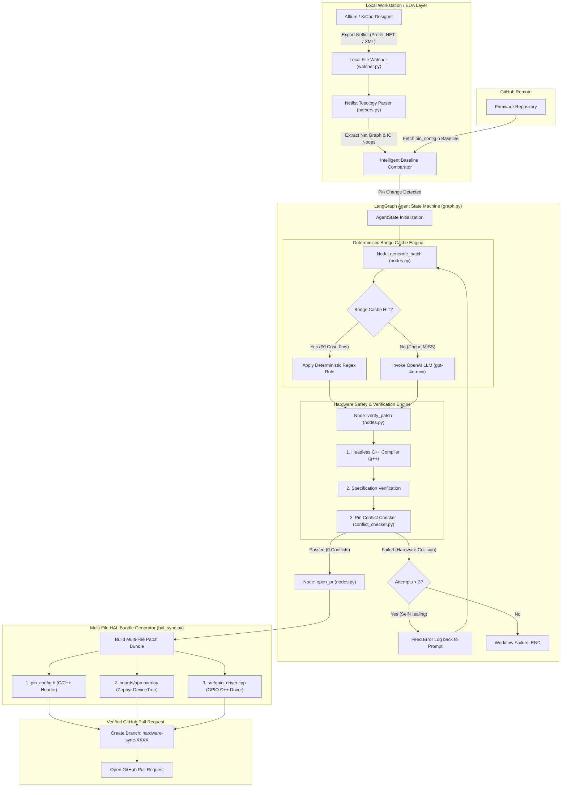

<div align="center">

# GitBed

**Automated Hardware-to-Software CI/CD Agent for Enterprise Embedded Systems**

[](LICENSE)
[](https://www.python.org/downloads/)
[](https://github.com/langchain-ai/langgraph)
[](#security-and-privacy-model)

*GitBed bridges the gap between EDA hardware design and firmware engineering by automatically detecting netlist changes in Altium Designer and KiCad, verifying hardware constraints, and submitting atomic, multi-file Pull Requests to GitHub.*

</div>

---

## Key Capabilities

| Capability | Technical Mechanism | Enterprise Benefit |
|---|---|---|
| **Zero-Trust On-Premise Parsing** | Local file watcher and net topology engine (`watcher.py`, `parsers.py`) | Proprietary CAD schematics and PCB layouts remain 100% on-premise. |
| **Multi-File HAL Synchronization** | Atomic patch bundle generator (`hal_sync.py`) | Synchronizes C++ macros, Zephyr/Linux DeviceTree overlays, and HAL driver code. |
| **Self-Healing Reflection Loop** | Headless `g++` compilation + Pin Conflict Guard | Detects double-allocated pins and syntax errors, self-healing before PR creation. |
| **Deterministic Bridge Cache** | Rule caching engine (`bridge.py`) | Executes known reassignment rules with **0ms latency and $0 AI API cost**. |

---

## Example Pull Request Output

When a hardware engineer re-routes a trace in Altium or KiCad, GitBed generates a verified multi-file Pull Request:

```diff
# pin_config.h (C/C++ Macro Header)
  // Kame_PDB Hardware Configurations
  #define VCC3SW_PIN P1
  #define ESC_EN_PIN P12
- #define INA_SDA_PIN P4
+ #define INA_SDA_PIN P6
  #define INA_SCL_PIN P5

# boards/app.overlay (Zephyr RTOS DeviceTree Overlay)
  leds {
      compatible = "gpio-leds";
-     ina_sda_led: ina_sda { gpios = <&gpio4 7 GPIO_ACTIVE_HIGH>; };
+     ina_sda_led: ina_sda { gpios = <&gpio6 7 GPIO_ACTIVE_HIGH>; };
  };

# src/gpio_driver.cpp (GPIO Driver Initialization)
  void init_gpio_ina_sda() {
      GPIO_InitTypeDef gpio_init = {0};
-     gpio_init.Pin = INA_SDA_PIN; // P4
+     gpio_init.Pin = INA_SDA_PIN; // P6
      HAL_GPIO_Init(GPIOB, &gpio_init);
  }
```

---

## Architecture and Execution Flow

GitBed models its pipeline as a stateful, directed graph using LangGraph. Netlist changes are parsed locally, compared against the baseline firmware on GitHub, and processed through a multi-stage verification loop.



---

## Installation & Quickstart

### Prerequisites
- Python 3.10+
- `g++` (for local headless compiler verification)

### Setup

```bash
# Clone the repository
git clone https://github.com/yuhtuna/gitbed.git
cd gitbed

# Install Python dependencies
pip install -r requirements.txt

# Configure environment variables
cp .env.example .env
```

Edit `.env` to supply your credentials:

```env
OPENAI_API_KEY="your-openai-api-key"
GITHUB_TOKEN="your-github-personal-access-token"
GITHUB_REPO="your-org/firmware-repo"
```

### Running a Standalone Mock Sync

```bash
python gitbed_engine.py
```

---

## Live Watcher Deployment

To run GitBed as an automated background service monitoring live EDA exports:

```bash
python gitbed_engine.py --watch "C:/Users/Public/Documents/Altium/Sample - Kame_PDB/Project Outputs"
```

### Workflow
1. Modify a net or pin assignment in Altium Designer or KiCad.
2. Save the schematic (`Ctrl+S`) and export the netlist (**Design -> Netlist For Project -> Protel / XML**).
3. GitBed automatically detects the exported file, extracts net topology, verifies hardware constraints, and opens a GitHub Pull Request.

---

## Integration Methods

| Integration Method | Configuration | Environment Target |
|---|---|---|
| **Altium OutJob (Recommended)** | Add a **Netlist Outputs -> Export Netlist** generator targeting watched folder | Local Workstation / Windows |
| **Altium Native Script Hook** | Add `altium/GitBed_Export_Hook.py` to Altium Scripts directory | Local Workstation (1-Click) |
| **Cloud Webhooks** | Configure Webhook on `Project Release` event targeting GitBed API endpoint | Altium 365 / Enterprise Cloud |

---

## Security and Privacy Model

GitBed is designed around a **Zero-Trust Security Boundary**:

- **On-Premise CAD Processing:** Raw schematic binary files (`.SchDoc`, `.kicad_sch`), PCB layout files (`.PcbDoc`), and manufacturing outputs remain entirely on local hardware.
- **Minimal Payload Exposure:** Only anonymized net topology payloads (`{"signal": "INA_SDA", "new_pin": "P6"}`) and the specific header file (`pin_config.h`) interact with verification logic.
- **Air-Gapped LLM Compatibility:** The engine supports self-hosted LLMs (via `Ollama`, `vLLM`, or Azure OpenAI Zero-Data-Retention instances) for air-gapped defense and aerospace environments.

---

## Core Pipeline Architecture

### 1. Watcher & Net Topology Parser (`watcher.py`, `parsers.py`)
Parses netlist structures across multiple EDA formats (Altium XML, Protel `.NET`, KiCad S-expressions). Groups all connected component nodes per net (`connected_nodes`) to build the complete schematic topology graph.

### 2. Self-Synthesizing Bridge Cache Engine (`bridge.py`)
Intercepts pin reassignment requests. If a rule exists in `.gitbed_rules.json`, GitBed executes a local regex patch with **0ms latency and $0 AI API cost**. Successful LLM patches automatically synthesize and cache new rules for future executions.

### 3. Verification & Hardware Pin Conflict Guard (`conflict_checker.py`, `utils.py`)
Executes a three-stage validation pipeline:
1. **Syntax Check:** Headless compilation via `g++ -fsyntax-only`.
2. **Specification Check:** Confirms requested pin declarations are explicitly present in the patch.
3. **Hardware Pin Conflict Guard:** Scans the pin allocation matrix to prevent double-allocating pins across peripherals.

### 4. Multi-File HAL & DeviceTree Sync (`hal_sync.py`)
Synchronizes changes across the entire firmware stack:
- `pin_config.h` (C/C++ Macro Header Constants)
- `boards/app.overlay` (Zephyr / Linux RTOS DeviceTree Overlay)
- `src/gpio_driver.cpp` (HAL Initialization Driver Code)

### 5. Self-Healing Reflection Router (`graph.py`, `nodes.py`)
If a syntax error or pin collision occurs during verification, the router redirects execution back to the generation node with full compiler diagnostics included in the LLM context, allowing the agent to self-heal.

---

## Repository Layout

```text
gitbed/
├── .github/workflows/
│   └── gitbed-sync.yml       # GitHub Actions CI/CD workflow template
├── altium/
│   └── GitBed_Export_Hook.py # Altium Designer native script hook
├── gitbed/
│   ├── bridge.py             # Self-Synthesizing Bridge Cache Engine
│   ├── conflict_checker.py   # Hardware pin conflict guard
│   ├── hal_sync.py           # Multi-file HAL patch generator
│   ├── parsers.py            # KiCad and Altium EDA netlist parsers
│   ├── state.py              # AgentState schema definition
│   ├── utils.py              # Compilation and GitHub integrations
│   ├── nodes.py              # Agent Node implementations
│   ├── watcher.py            # EDA live directory watcher
│   └── graph.py              # StateGraph assembly and routing
├── tests/                    # Automated unit and integration test suite
├── gitbed_engine.py          # Main application entry point
└── LICENSE                   # AGPL-3.0 License
```

---

## Testing

Execute the automated unit and integration test suite:

```bash
pytest -v
```

---

## License

GitBed is licensed under the GNU Affero General Public License v3.0 (AGPL-3.0). See the `LICENSE` file for details.
