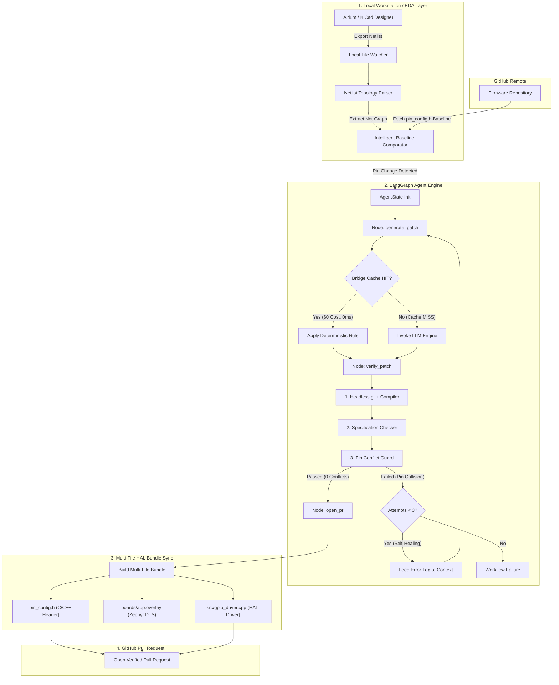

# GitBed

> Automated Hardware-to-Software CI/CD Agent. Bridge the gap between EDA schematics and firmware codebases.

[](LICENSE)
[](https://www.python.org/downloads/)
[](https://github.com/langchain-ai/langgraph)
[](#supported-eda-tools--integration-modes)

GitBed monitors **Altium Designer** and **KiCad** netlist exports and automatically generates verified, multi-file Pull Requests on GitHub—keeping C/C++ firmware headers, Zephyr/Linux RTOS DeviceTree overlays, and HAL drivers in sync with physical PCB revisions.

---

## Key Features

- **Automated Netlist Drift Detection:** Watches EDA export directories for netlist updates (`.NET`, `.xml`, `.rpt`).
- **Multi-File Stack Synchronization:** Simultaneously updates `pin_config.h`, Zephyr `boards/app.overlay`, and `src/gpio_driver.cpp`.
- **Hardware Pin Conflict Guard:** Cross-checks MCU peripheral assignments to detect duplicate pins and prevent short circuits.
- **Headless Compiler Verification:** Compiles generated C++ patches locally with `g++ -fsyntax-only` before creating Pull Requests.
- **Self-Healing Reflection Loop:** Uses LangGraph state machine loops to auto-correct syntax and hardware collision errors.
- **Deterministic Bridge Cache:** Intercepts known pin reassignments locally with regex ($0 API cost, 0ms latency).
- **Zero-Trust On-Prem Execution:** Raw CAD schematics never leave your local machine; only anonymized pin diffs are processed.

---

## System Architecture

The GitBed execution pipeline is structured as a stateful, directed graph using **LangGraph**.



---

## Example Generated Patch

When a hardware engineer moves `INA_SDA` from Pin 4 to Pin 6 in Altium, GitBed generates a verified 3-file Pull Request:

### 1. C/C++ Header (`pin_config.h`)
```diff
 // Kame_PDB Hardware Configurations
 #define VCC3SW_PIN P1
 #define ESC_EN_PIN P12
-#define INA_SDA_PIN P4
+#define INA_SDA_PIN P6
 #define INA_SCL_PIN P5
```

### 2. Zephyr DeviceTree Overlay (`boards/app.overlay`)
```diff
 / {
     leds {
         compatible = "gpio-leds";
+        ina_sda_led: ina_sda {
+            gpios = <&gpio6 7 GPIO_ACTIVE_HIGH>;
+            label = "System Status LED";
+        };
     };
 };
```

### 3. GPIO Driver (`src/gpio_driver.cpp`)
```diff
+#include "pin_config.h"
+
+void init_gpio_ina_sda() {
+    GPIO_InitTypeDef gpio_init = {0};
+    gpio_init.Pin = INA_SDA_PIN;
+    gpio_init.Mode = GPIO_MODE_OUTPUT_PP;
+    HAL_GPIO_Init(GPIOB, &gpio_init);
+}
```

---

## Quickstart

### Installation

```bash
# Clone the repository
git clone https://github.com/yuhtuna/gitbed.git
cd gitbed

# Install dependencies
pip install -r requirements.txt

# Configure environment variables
cp .env.example .env
```

### Configuration (`.env`)

Set your GitHub authentication token and target firmware repository in `.env`:

```env
OPENAI_API_KEY="your-openai-key"
GITHUB_TOKEN="your-github-pat-token"
GITHUB_REPO="your-username/firmware-repo"
```

### Running the Live Watcher

Start monitoring your EDA export folder:

```bash
python gitbed_engine.py --watch "C:/path/to/altium/Project Outputs"
```

Now, every time you save and export a netlist from Altium or KiCad, GitBed automatically validates the diff and submits a Pull Request.

---

## Supported EDA Tools & Integration Modes

| Mode | EDA Tool | Trigger | Description |
|---|---|---|---|
| **OutJob Export** | Altium Designer | Manual / Auto Save | Generates Protel `.NET` export to watched directory |
| **Native Script Hook** | Altium Designer | Menu / Button Click | Runs `altium/GitBed_Export_Hook.py` directly inside Altium |
| **Direct File Watch** | KiCad 6+ | Export Netlist | Monitors `.net` output directory for schematic revisions |
| **Cloud Webhook** | Altium 365 | Project Release | Headless serverless trigger on cloud netlist releases |

---

## Core Pipeline Architecture

### 1. Topology Parser (`gitbed/parsers.py`)
Parses Altium XML/Protel and KiCad netlists into graph topologies. Groups all connected ICs (`U`), connectors (`CN`), and passives (`R`/`C`) per net trace to identify true microcontroller pin reassignments.

### 2. State Machine (`gitbed/graph.py` & `nodes.py`)
Built on **LangGraph**. Tracks execution state (`AgentState`) through graph nodes:
- `generate_patch`: Consults Bridge Cache or invokes LLM (`gpt-4o-mini`).
- `verify_patch`: Runs `g++` compilation, specification verification, and conflict checking.
- `open_pr`: Assembles multi-file HAL bundle and submits PR via GitHub API.

### 3. Safety Guard & Reflection Loop (`gitbed/conflict_checker.py`)
Prevents hardware short circuits by verifying that no two signals are assigned to the same MCU pin. If a conflict or syntax error occurs, the reflection loop routes the diagnostic back to the LLM to self-heal up to 3 times.

---

## Project Structure

```text
gitbed/
├── .github/workflows/
│   └── gitbed-sync.yml       # GitHub Actions workflow template
├── altium/
│   └── GitBed_Export_Hook.py # Native Altium Designer script hook
├── gitbed/
│   ├── bridge.py             # Deterministic Bridge Cache engine
│   ├── conflict_checker.py   # Hardware pin conflict guard
│   ├── hal_sync.py           # Multi-file HAL patch generator
│   ├── parsers.py            # KiCad & Altium netlist parsers
│   ├── state.py              # AgentState schema definition
│   ├── utils.py              # C++ compiler & GitHub API utilities
│   ├── nodes.py              # Agent node logic & LLM prompts
│   ├── watcher.py            # EDA output directory watcher
│   └── graph.py              # LangGraph state machine assembly
├── tests/                    # Unit and integration test suite
├── gitbed_engine.py          # Main application entry point
└── LICENSE                   # AGPL-3.0 Open-Source License
```

---

## Testing

Execute the automated test suite using pytest:

```bash
pytest -v
```

---

## License

GitBed is open-source software licensed under the **GNU Affero General Public License v3.0 (AGPL-3.0)**. See [LICENSE](LICENSE) for details.
