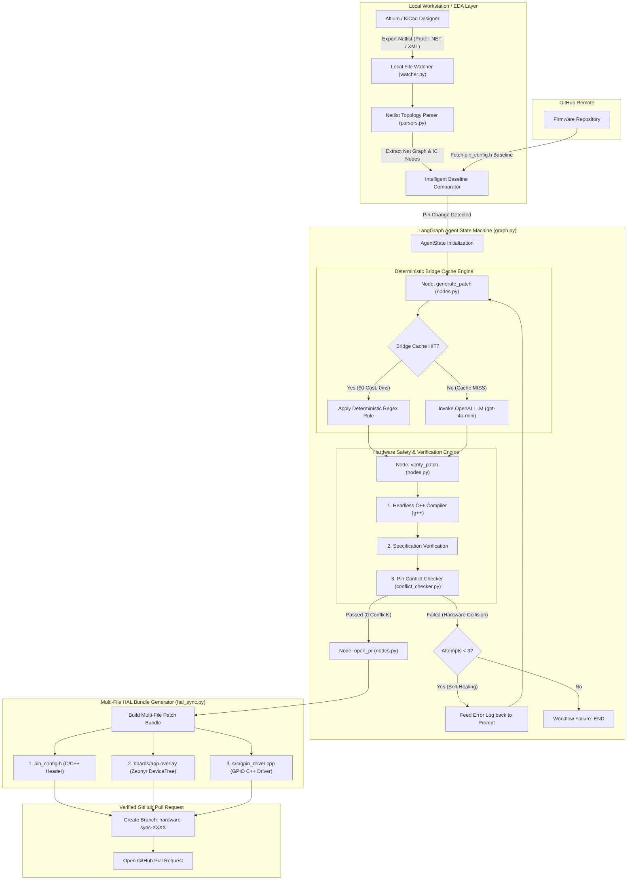

# GitBed

Automated hardware-to-software CI/CD agent for Enterprise.

GitBed monitors Altium Designer and KiCad netlist exports and automatically generates verified C++ Pull Requests to keep firmware tightly synchronized with hardware revisions.

---

## Architecture and System Flow

The GitBed execution pipeline is structured as a stateful, directed graph using LangGraph. It incorporates an automated self-healing reflection loop to catch syntax errors and hardware pin collisions before opening pull requests.



---

## Quickstart

```bash
git clone https://github.com/yuhtuna/gitbed.git
cd gitbed

pip install -r requirements.txt

# Copy environment variables template and configure your keys
cp .env.example .env

# Run the standard pipeline on a mock hardware diff
python gitbed_engine.py
```

---

## Live Watcher Workflow

To run GitBed as a background service mirroring an Enterprise environment:

1. Configure your target GitHub repository in `.env`:
   ```env
   GITHUB_REPO="your-org/firmware-repo"
   ```
2. Start the GitBed Live Watcher on your EDA project output directory:
   ```bash
   python gitbed_engine.py --watch "C:/Users/Public/Documents/Altium/Sample - Kame_PDB/Project Outputs"
   ```
3. Modify a pin assignment in Altium Designer or KiCad.
4. Export the netlist (**Design -> Netlist For Project -> Protel / XML**).
5. GitBed automatically detects the file, parses net topology, compiles C++ patches headlessly, checks for hardware pin collisions, and submits a multi-file Pull Request on GitHub.

---

## EDA Integration Modes

GitBed supports three integration modes for Altium Designer and KiCad:

### 1. Automated OutJob Export
Add a **Netlist Outputs -> Export Netlist** generator to your Altium OutJob file (`.OutJob`) targeting your watched directory. Every save and export automatically updates firmware.

### 2. Altium Native Script Hook
Add `altium/GitBed_Export_Hook.py` to your Altium Designer Scripts directory. Run `SyncWithGitBed` inside Altium Designer to trigger instant netlist extraction and PR creation.

### 3. Cloud Webhooks
For Altium 365 cloud workspaces, configure Webhook notifications on `Project Release` or `Netlist Modified` events to trigger GitBed's CI/CD pipeline headlessly.

---

## Core Pipeline Components

### 1. Zero-Trust Local Watcher & Net Topology Parser (`watcher.py`, `parsers.py`)
- Raw CAD schematics and PCB layout files remain 100% on-premise.
- Extracts full net topology across all connected ICs and passives (`connected_nodes`).
- Compares netlist output against GitHub baseline code to isolate true IC pin changes.

### 2. Self-Synthesizing Bridge Cache Engine (`bridge.py`)
- Intercepts pin reassignment requests and attempts deterministic local regex execution.
- If a matching rule exists, it executes instantly with 0ms latency and $0 AI API cost.
- Automatically caches new rules upon successful verification.

### 3. Verification & Hardware Pin Conflict Checker (`conflict_checker.py`, `utils.py`)
- **Syntax Check:** Headless C++ compilation via `g++ -fsyntax-only`.
- **Specification Check:** Ensures newly assigned pins are explicitly present in the patch.
- **Hardware Conflict Guard:** Cross-checks the pin assignment matrix to prevent double-allocating pins or creating bus collisions.

### 4. Multi-File HAL & DeviceTree Sync (`hal_sync.py`)
Synchronizes hardware modifications across three layers of the firmware stack:
1. `pin_config.h` — C/C++ Macro Header Constants
2. `boards/app.overlay` — Zephyr / Linux RTOS DeviceTree Hardware Overlay
3. `src/gpio_driver.cpp` — Hardware Abstraction Layer Initialization Driver

### 5. Self-Healing Reflection Router (`graph.py`, `nodes.py`)
If a syntax error or pin collision occurs during verification, the router redirects execution back to the generation node with full compiler diagnostics included in the context, allowing the agent to self-heal.

---

## Repository Structure

```text
gitbed/
├── .github/workflows/
│   └── gitbed-sync.yml       # GitHub Actions CI/CD workflow template
├── altium/
│   └── GitBed_Export_Hook.py # Altium Designer native script hook
├── gitbed/
│   ├── bridge.py             # Self-Synthesizing Bridge Cache Engine
│   ├── conflict_checker.py   # Hardware pin conflict guard
│   ├── hal_sync.py           # Multi-file HAL patch generator
│   ├── parsers.py            # KiCad and Altium EDA netlist parsers
│   ├── state.py              # AgentState schema definition
│   ├── utils.py              # Compilation and GitHub integrations
│   ├── nodes.py              # Agent Node implementations
│   ├── watcher.py            # EDA live directory watcher
│   └── graph.py              # StateGraph assembly and routing
├── tests/                    # Automated unit and integration test suite
├── gitbed_engine.py          # Main application entry point
└── LICENSE                   # AGPL-3.0 License
```

---

## Testing

Execute the automated test suite using pytest:

```bash
pytest -v
```

---

## License

This software is licensed under the GNU Affero General Public License v3.0 (AGPL-3.0). See the `LICENSE` file for full text.
